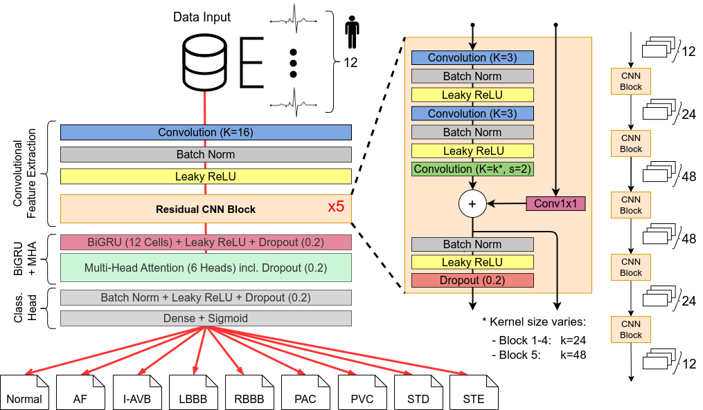
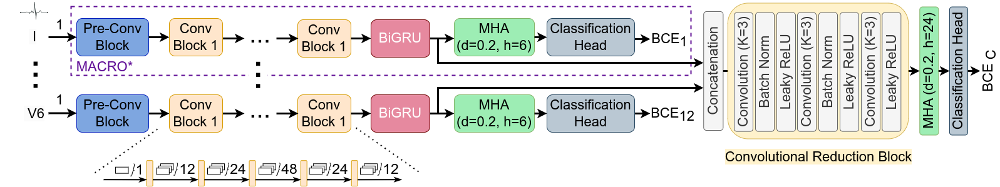

# MACRO-Towards-Classification-of-Co-Occurring-Diseases-in-12-Lead-ECGs

Official PyTorch implementation of the paper "MACRO: A Multi-Head Attentional Convolutional Recurrent Network for 
Multi-Label Classification of Co-Occurring Diseases in 12-Lead ECGs"

## Requirements
This project was developed using Python 3.10.12 and PyTorch 2.0.1.
The `requirements.txt` contains all Python libraries that the project depends on, and can be installed using:
```console
pip install -r requirements.txt
```

## Model Architectures

### MACRO



### Multi-Branch MACRO (MB-M)



## Dataset  
The dataset used in this study is the CPSC 2018 dataset, which contains 6877 ECG recordings.
We preprocess the dataset by resampling the ECG signals to 250 Hz and equalizing the ECG signal length to 60 seconds, 
yielding a signal length of T=15,000 data points per recording. 
For the hyperparameter study, we employed a fixed train-valid-test split with ratio 60-20-20,
while for the final evaluations, including the comparison with the state-of-the-art methods and ablation studies, 
we used a 10-fold cross-validation strategy.

Our preprocessed data can be downloaded from [FigShare](https://figshare.com/account/projects/200089/articles/25532869) 
and should be placed in the `data` directory at project root level while maintaining the folder structure. 
In case of using the fixed train-valid-test split, 
the valid set is automatically created from the training set during the training process.

Alternatively, the raw CPSC 2018 dataset can be downloaded from the website of the 
[PhysioNet/Computing in Cardiology Challenge 2020](https://physionet.org/content/challenge-2020/1.0.2/training/cpsc_2018/#files-panel). 
The downloaded `.mat` and `.hea` files can be merged and copied to `data/CinC_CPSC/raw`. 
Then, our preprocessing pipeline can be executed manually by running the `preprocesssing/preprocess_cpsc.py` script
to get our preprocessed data and folder structure, including the data split and cross-validation folder.

## Device Preparation: GPU Specification
To train the models, we recommend using a GPU. 
The device ID can be set in the configuration file `global_config.py` by adapting the 
CUDA_VISIBLE_DEVICES variable.  

## Training and Testing with Fixed Data Split
To train one of the models with the fixed 60-20-20 data split, run the following command with the path to
the corresponding configuration file of interest:
```console
python train.py -c configs/single_run_example/config_baseline.json
```

To evaluate a trained model on the test set, run the following command
with the path to the corresponding configuration file of interest:
```console
python test.py --resume <path_to_model_checkpoint> --test_dir data/CinC_CPSC/test/preprocessed/250Hz/60s
```

Example resume path: 
<project_path>/savedVM/models/Baseline/run_id/model_best.pth


## Training with Hyperparameter Tuning
To train the model with hyperparameter tuning via RayTune, run the following command with the path to 
the corresponding configuration file of interest and the `--tune` flag:
```console
python train.py -c configs/param_study_examples/config.json --tune
```

**Important**: The hyperparameter search space can be defined in the `tuning_params` method of the `train.py` file 
by specifying the search space for the architecture type of interest.

## Training with 10-Fold Cross-Validation
To train the model with 10-fold cross-validation, run the following command with the path to the
corresponding configuration file of interest:

```console
python train_with_cv.py -c configs/CV/config.json
```


## Machine Learning Classifiers
To train and evaluate machine learning classifiers, the input and output tensors across all folds need to be retrieved,
while maintaining the fold structure and data split.
For this, run the following command:
```console
python ML_ensemble/retrieve_detached_cross_fold_tensors.py -p <path_to_trained_model>
```
Example path: <project_path>/savedVM/models/Multibranch_MACRO_CV/run_id/

Afterwards, the ML classifiers can be trained and evaluated based on these tensors by running the following command:
```console
python ML_ensemble/train_ML_models_with_detached_tensors.py
 -p <path_to_trained_model>
 --strategy "gradient_boosting"
```
By default, all features from the Multi-Branch MACRO (MB-M) and all BranchNets are used (i.e., 117 features). 
For a reduced feature set, the following flags can be passed: 
- `--individual_features` : Predicted probabilities only for the class of interest (13 features)
- `--reduced_individual_features` : Predicted probabilities only for the class of interest w/o MB-M (12 features)